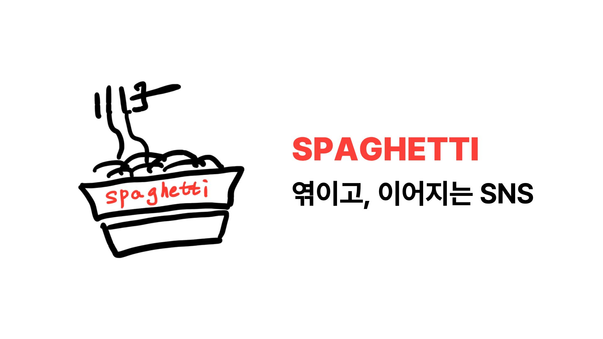

# Spaghetti - 엮이고 이어지는 공간



> **Spaghetti(스파게티)**는 사람들이 엮이고 이어지는 SNS 플랫폼입니다.  
> 스파게티 면처럼 서로가 연결되어 새로운 이야기를 만드는 공간입니다.

[](https://spaghetti-sns.vercel.app)
[](https://react.dev)
[](https://www.typescriptlang.org/)
[](https://supabase.com)

## **배포 링크**

[https://spaghetti-sns.vercel.app/](https://spaghetti-sns.vercel.app/)

## 테스트 계정

빠르게 서비스를 테스트해보려면 아래 계정으로 로그인하세요.

| 항목         | 정보          |
| ------------ | ------------- |
| **이메일**   | test@test.com |
| **비밀번호** | test1234      |

---

## 목차

- [프로젝트 개요](#-프로젝트-개요)
- [주요 기능](#-주요-기능)
- [기술 스택](#-기술-스택)
- [프로젝트 구조](#-프로젝트-구조)
- [핵심 기술 가이드](#-핵심-기술-가이드)
- [배포](#-배포)
- [개발 규칙](#-개발-규칙)

---

## 프로젝트 개요

**Spaghetti**는 SNS 플랫폼으로, 사용자들이 게시물을 공유하고, 상호작용하고, 커뮤니티를 형성할 수 있도록 설계되었습니다. 회원가입 시 자동으로 생성되는 파스타 이름의 닉네임으로 시작하는 재밌는 경험을 제공합니다.

## 주요 기능

### 인증 & 권한 관리

- **이메일 기반 가입/로그인** - Supabase Auth 활용
- **GitHub, KaKao OAuth 통합** - GitHub, KaKao 계정으로 간편 로그인 가능
- **자동 닉네임 생성** - 회원가입 시 파스타 이름으로 조합된 고유 닉네임 자동 할당 (예: "쫄깃한스파게티42")
- **비밀번호 찾기** - 안전한 재설정 프로세스
- **세션 관리** - Zustand 기반 전역 상태 관리

### 게시물(Post) 기능

- **무한 스크롤** - Tanstack Query 기반의 자동 페이지네이션
- **게시물 CRUD** - 생성, 조회, 수정, 삭제
- **이미지 업로드** - Supabase Storage 활용
- **좋아요(Like)** - 실시간 상호작용
- **게시물 상세 보기** - 전체 댓글과 함께 표시

### 댓글(Comment) 기능

- **무한 중첩 댓글** - 댓글 내 대댓글 지원
- **댓글 CRUD** - 전체 수명 주기 관리
- **실시간 업데이트** - Tanstack Query를 통한 자동 동기화

### 프로필(Profile) 기능

- **프로필 조회** - 사용자 정보 및 게시물 목록
- **프로필 수정** - 아바타, 자기소개 변경
- **작성글 확인** - 자신의 작성한 글 목록 확인

### UI/UX

- **다크/라이트 모드** - next-themes 기반 테마 전환
- **반응형 디자인** - 모바일, 태블릿, 데스크톱 완벽 대응
- **로딩 상태 관리** - Tanstack Query 자동 처리
- **토스트 알림** - Sonner를 통한 사용자 피드백
- **접근성(A11y)** - Radix UI 기반 컴포넌트

---

## 기술 스택

### 프론트엔드

| 분류              | 기술         | 버전   | 목적                      |
| ----------------- | ------------ | ------ | ------------------------- |
| **Framework**     | React        | 19.1.0 | UI 렌더링                 |
| **Language**      | TypeScript   | 5.8.3  | 타입 안전성               |
| **Build Tool**    | Vite         | 6.3.5  | 빠른 번들링               |
| **Router**        | React Router | 7.7.0  | 페이지 라우팅             |
| **Styling**       | Tailwind CSS | 4.1.11 | 유틸리티 기반 스타일링    |
| **UI Components** | Shadcn/ui    | Latest | 고품질 컴포넌트           |
| **UI Primitives** | Radix UI     | Latest | 접근성 있는 기초 컴포넌트 |

### 상태 관리

| 기술               | 버전   | 용도                               |
| ------------------ | ------ | ---------------------------------- |
| **Zustand**        | 5.0.6  | 전역 상태 관리 (UI 상태, 세션)     |
| **Tanstack Query** | 5.83.0 | 서버 상태 관리 (데이터 페칭, 캐싱) |

### 백엔드 & 데이터베이스

| 기술         | 용도                                         |
| ------------ | -------------------------------------------- |
| **Supabase** | PostgreSQL 데이터베이스, 인증, 파일 스토리지 |

### 라이브러리 & 유틸

- **next-themes**: 테마 관리 (다크/라이트 모드)
- **react-intersection-observer**: 무한 스크롤 구현
- **embla-carousel-react**: 이미지 캐러셀
- **lucide-react**: 아이콘 라이브러리
- **sonner**: 토스트 알림
- **immer**: 불변 상태 관리
- **clsx / tailwind-merge**: 클래스명 조합

---

## 프로젝트 구조

```
src/
├── api/                          # Supabase API 호출 함수들
│   ├── auth.ts                   # 인증 관련 API
│   ├── post.ts                   # 게시물 관련 API
│   ├── comment.ts                # 댓글 관련 API
│   ├── profile.ts                # 프로필 관련 API
│   └── image.ts                  # 이미지 업로드 API
│
├── components/                   # React 컴포넌트
│   ├── layout/                   # 레이아웃 컴포넌트
│   │   ├── global-layout.tsx      # 전역 레이아웃
│   │   ├── header/               # 헤더 컴포넌트
│   │   ├── guest-only-layout.tsx  # 비로그인 사용자용
│   │   └── member-only-layout.tsx # 로그인 사용자용
│   │
│   ├── post/                     # 게시물 관련 컴포넌트
│   │   ├── post-feed.tsx         # 피드 목록
│   │   ├── post-item.tsx         # 게시물 카드
│   │   ├── create-post-button.tsx # 게시물 생성 버튼
│   │   ├── edit-post-button.tsx  # 게시물 수정 버튼
│   │   ├── delete-post-button.tsx # 게시물 삭제 버튼
│   │   └── like-post-button.tsx  # 좋아요 버튼
│   │
│   ├── comment/                  # 댓글 관련 컴포넌트
│   │   ├── comment-list.tsx      # 댓글 목록
│   │   ├── comment-item.tsx      # 댓글 아이템
│   │   └── comment-editor.tsx    # 댓글 작성기
│   │
│   ├── profile/                  # 프로필 관련 컴포넌트
│   │   ├── profile-info.tsx      # 프로필 정보
│   │   └── edit-profile-button.tsx # 프로필 수정 버튼
│   │
│   ├── modal/                    # 모달 컴포넌트
│   │   ├── post-editor-modal.tsx # 게시물 에디터 모달
│   │   ├── profile-editor-modal.tsx # 프로필 에디터 모달
│   │   └── alert-modal.tsx       # 알림 모달
│   │
│   └── ui/                       # UI 기본 컴포넌트
│       ├── button.tsx
│       ├── input.tsx
│       ├── textarea.tsx
│       ├── dialog.tsx
│       ├── alert-dialog.tsx
│       └── ...
│
├── hooks/                        # Custom React Hooks
│   ├── mutations/                # Tanstack Query Mutations
│   │   ├── auth/                 # 인증 관련 뮤테이션
│   │   ├── post/                 # 게시물 관련 뮤테이션
│   │   ├── comment/              # 댓글 관련 뮤테이션
│   │   └── profile/              # 프로필 관련 뮤테이션
│   │
│   └── queries/                  # Tanstack Query Queries
│       ├── use-infinite-posts-data.ts   # 무한 스크롤 게시물
│       ├── use-post-by-id-data.ts       # 특정 게시물 조회
│       ├── use-comments-data.ts         # 댓글 조회
│       └── use-profile-data.ts          # 프로필 조회
│
├── pages/                        # 페이지 컴포넌트
│   ├── index-page.tsx            # 메인 피드 페이지
│   ├── sign-up-page.tsx          # 회원가입 페이지
│   ├── sign-in-page.tsx          # 로그인 페이지
│   ├── forget-password-page.tsx  # 비밀번호 찾기 페이지
│   ├── reset-password-page.tsx   # 비밀번호 재설정 페이지
│   ├── post-detail-page.tsx      # 게시물 상세 페이지
│   └── profile-detail-page.tsx   # 프로필 페이지
│
├── provider/                     # Context Providers
│   ├── session-provider.tsx      # 세션 관리 프로바이더
│   └── modal-provider.tsx        # 모달 프로바이더
│
├── store/                        # Zustand Store (전역 상태)
│   ├── session.ts                # 사용자 세션 상태
│   ├── theme.ts                  # 테마 상태
│   ├── alert-modal.ts            # 알림 모달 상태
│   ├── post-editor-modal.ts      # 게시물 에디터 상태
│   └── profile-editor-modal.ts   # 프로필 에디터 상태
│
├── lib/                          # 유틸리티 함수 & 설정
│   ├── supabase.ts               # Supabase 클라이언트
│   ├── constants.ts              # 상수 정의
│   ├── utils.ts                  # 공통 함수
│   ├── error.ts                  # 에러 처리
│   └── time.ts                   # 시간 관련 함수
│
├── types.ts                      # TypeScript 타입 정의
├── database.types.ts             # Supabase 자동 생성 타입
├── App.tsx                       # 루트 컴포넌트
├── root-route.tsx                # 라우팅 설정
├── main.tsx                      # 엔트리 포인트
└── vite-env.d.ts                 # Vite 환경 타입
```

---

## 핵심 기술 가이드

### 1. 전역 상태 관리 (Zustand)

**Zustand 사용 이유**

- Redux보다 간단한 보일러플레이트
- 작고 빠른 번들 크기
- 자동 타입 추론 지원

**사용 예시 (세션 상태)**

```typescript
// src/store/session.ts
import { create } from "zustand";
import { immer } from "zustand/middleware/immer";

interface SessionState {
  user: User | null;
  isLoading: boolean;
  setUser: (user: User | null) => void;
  setLoading: (loading: boolean) => void;
}

export const useSessionStore = create<SessionState>()(
  immer((set) => ({
    user: null,
    isLoading: true,
    setUser: (user) => set({ user }),
    setLoading: (loading) => set({ isLoading: loading }),
  })),
);
```

**컴포넌트에서 사용**

```typescript
import { useSessionStore } from "@/store/session";

export const MyComponent = () => {
  const { user, isLoading } = useSessionStore();

  if (isLoading) return <Loader />;

  return <div>{user?.email}</div>;
};
```

### 2. 서버 상태 관리 (Tanstack Query)

**Tanstack Query**

- 자동 캐싱 및 동기화
- 로딩/에러 상태 자동 관리
- 백그라운드 리페칭 지원

**무한 쿼리 예시**

```typescript
// src/hooks/queries/use-infinite-posts-data.ts
import { useInfiniteQuery } from "@tanstack/react-query";
import { fetchPosts } from "@/api/post";

export const useInfinitePostsData = () => {
  return useInfiniteQuery({
    queryKey: ["posts"],
    queryFn: ({ pageParam = 0 }) => fetchPosts(pageParam),
    getNextPageParam: (lastPage) => lastPage.nextCursor,
    initialPageParam: 0,
  });
};
```

**컴포넌트에서 사용**

```typescript
const { data, fetchNextPage, hasNextPage, isLoading } = useInfinitePostsData();

const handleScroll = useCallback(() => {
  if (hasNextPage) {
    fetchNextPage();
  }
}, [fetchNextPage, hasNextPage]);
```

### 3. 무한 스크롤 구현

**react-intersection-observer 활용**

```typescript
import { useInView } from "react-intersection-observer";
import { useInfinitePostsData } from "@/hooks/queries/use-infinite-posts-data";

export const PostFeed = () => {
  const { data, fetchNextPage, hasNextPage } = useInfinitePostsData();
  const { ref } = useInView({
    onChange: (inView) => {
      if (inView && hasNextPage) {
        fetchNextPage();
      }
    },
  });

  return (
    <>
      {data?.pages.map((page) =>
        page.posts.map((post) => <PostItem key={post.id} post={post} />)
      )}
      <div ref={ref}>{hasNextPage && <Loader />}</div>
    </>
  );
};
```

### 4. 뮤테이션 (데이터 변경)

**좋아요 토글 예시**

```typescript
// src/hooks/mutations/post/use-toggle-post-like.ts
import { useMutation, useQueryClient } from "@tanstack/react-query";
import { togglePostLike } from "@/api/post";

export const useTogglePostLike = () => {
  const queryClient = useQueryClient();

  return useMutation({
    mutationFn: ({ postId, isLiked }: { postId: string; isLiked: boolean }) =>
      togglePostLike(postId, isLiked),
    onSuccess: () => {
      // 캐시 무효화하여 자동 리페칭
      queryClient.invalidateQueries({ queryKey: ["posts"] });
    },
  });
};
```

### 5. 테마 관리 (next-themes)

**다크/라이트 모드 전환**

```typescript
// src/store/theme.ts
import { useTheme } from "next-themes";

export const useThemeStore = () => {
  const { theme, setTheme } = useTheme();

  const toggleTheme = () => {
    setTheme(theme === "dark" ? "light" : "dark");
  };

  return { theme, toggleTheme };
};
```

### 6. 자동 닉네임 생성 (회원가입 시)

**Spaghetti만의 독특한 기능: 파스타 이름 기반 닉네임**

회원가입 시 자동으로 생성되는 닉네임은 형용사 + 파스타 종류 + 숫자 조합으로 이루어져 있습니다.

```typescript
// src/lib/utils.ts
// 맛을 표현하는 형용사들
const adjectives = [
  "쫄깃한", // al dente의 느낌
  "고소한", // 고소한 맛
  "담백한", // 깔끔한 맛
  "부드러운", // 부드러운 식감
  "풍미있는", // 풍부한 풍미
  "진한", // 진한 맛
  "깔끔한", // 깔끔함
  "촉촉한", // 촉촉한 식감
  "고급스러운", // 고급스러움
  // ... 총 20개의 형용사
];

// 다양한 파스타 종류들
const nouns = [
  "스파게티", // 가장 대표적인 롱 파스타
  "페투치네", // 넓은 띠 모양
  "링귀네", // 긴 띠 모양
  "탈리아텔레", // 얇은 띠 모양
  "펜네", // 튜브 모양
  "푸실리", // 나선형 모양
  "파르팔레", // 나비 모양
  "뇨끼", // 작은 경단 모양
  "라자냐", // 넓은 시트 모양
  // ... 총 20개의 파스타 종류
];

export const getRandomNickname = () => {
  // 임의의 형용사 선택
  const adjective = adjectives[Math.floor(Math.random() * adjectives.length)];

  // 임의의 파스타 이름 선택
  const noun = nouns[Math.floor(Math.random() * nouns.length)];

  // 0~99 사이의 임의의 숫자 할당
  const number = Math.floor(Math.random() * 100);

  // 최종 닉네임: "쫄깃한스파게티42" 형식
  return `${adjective}${noun}${number}`;
};
```

**회원가입 시 닉네임 자동 할당**

```typescript
// src/api/profile.ts
import { getRandomNickname } from "@/lib/utils";

export async function createProfile(userId: string) {
  const { data, error } = await supabase
    .from("profile")
    .insert({
      id: userId,
      nickname: getRandomNickname(), // 자동으로 생성된 닉네임 할당
    })
    .select()
    .single();

  if (error) throw error;
  return data;
}
```

**사용자는 언제든지 프로필에서 닉네임 변경 가능**

프로필 수정 화면에서 원하는 닉네임으로 변경할 수 있습니다.

---

## 배포

### vercel을 활용하여 배포

Spaghetti는 Vercel에 배포되어 있습니다.

---

## 개발 규칙

### 커밋 컨벤션

> Gitmoji를 함께 사용

feat: 새로운 기능 추가
fix: 버그 수정
docs: 문서 수정
style: 코드 스타일 변경 (기능 변화 없음)
refactor: 코드 리팩토링

### TypeScript 작성 규칙

- 암시적 `any` 타입 사용 금지
- 컴포넌트는 `React.FC<Props>` 또는 함수 선언 사용
- 모든 API 함수는 반환 타입 명시
- Custom Hooks는 `use` 접두사 사용
